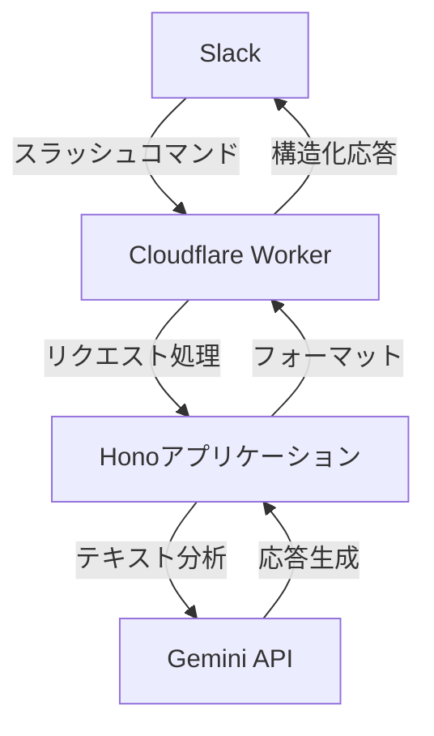

# Mechachang アーキテクチャドキュメント

## 1. プロジェクト概要

Mechangは、Cloudflare WorkersとHonoフレームワークを使用して実装された、Gemini 2.0 Flash APIを活用したSlackボットです。
ユーザーからのSlackコマンドを受け取り、Gemini AIを使用して高度な自然言語処理を行い、構造化された応答を返すシステムです。

### 1.1 主な目的

- Slackを通じたGemini 2.0 Flash APIへの簡単なアクセス提供
- 入力テキストの自動分析による最適な応答モードの選択
- 構造化された一貫性のある応答フォーマットの提供

## 2. 主要機能と特徴

### 2.1 コアシステム機能

- Slackスラッシュコマンド（`/gemini`）インターフェース
- 入力テキストの自動分析と分類
- モード別の最適化された応答生成
- 非同期処理による高速なユーザーフィードバック

### 2.2 応答モード

1. **Generalモード**
   - 一般的な質問や会話の処理
   - 要約と主要ポイントの抽出
   - 感情分析の提供

2. **Codeモード**
   - プログラミング関連の質問への対応
   - コード生成と説明
   - 言語固有のフォーマット適用

3. **Dataモード**
   - データ分析と統計処理
   - インサイトの抽出
   - 具体的な推奨事項の提供

4. **Creativeモード**
   - クリエイティブな文章生成
   - スタイル指定による柔軟な生成
   - 複数のバリエーション提供

## 3. アーキテクチャ設計

### 3.1 システム構成

### 3.2 コアコンポーネント

1. **InputAnalyzer**
   - テキスト入力の分析
   - 適切な処理モードの決定
   - コンテキスト情報の抽出

2. **GeminiModelManager**
   - Gemini APIとの対話管理
   - モデルインスタンスの制御
   - 安全性設定の適用

3. **ResponseFormatter**
   - モード別の応答フォーマット
   - 一貫性のある出力構造
   - Slack用のマークダウン変換

4. **RequestProcessor**
   - リクエストフローの制御
   - エラーハンドリング
   - 非同期処理の管理

## 4. 技術スタックと依存関係

### 4.1 主要技術

- **TypeScript**: 型安全性と開発効率の向上
- **Hono**: 軽量で高速なWebフレームワーク
- **Cloudflare Workers**: エッジコンピューティングプラットフォーム
- **Gemini 2.0 Flash API**: AIモデルサービス

### 4.2 開発ツール

- **Vitest**: テストフレームワーク
- **Wrangler**: Cloudflare Workers開発ツール
- **Prettier**: コードフォーマッター

## 5. 実装の詳細

### 5.1 リクエスト処理フロー

1. Slackリクエストの受信と検証
2. 入力テキストの分析
3. 適切なモードでの処理
4. 応答の生成とフォーマット
5. 非同期での結果返送

### 5.2 エラーハンドリング

- リクエスト検証エラー
- API制限エラー
- 処理タイムアウト
- 不正な入力形式

### 5.3 パフォーマンス最適化

- シングルトンパターンの活用
- 効率的なメモリ管理
- 応答時間の最適化

## 6. セキュリティ考慮事項

### 6.1 実装済みのセキュリティ機能

- Slackリクエストの署名検証
- タイムスタンプ検証（5分以上古いリクエストを拒否）
- 環境変数による認証情報管理

### 6.2 セキュリティベストプラクティス

- 定期的な依存関係の更新
- セキュリティヘッダーの適切な設定
- エラーメッセージの適切な制御

## 7. 開発とデプロイメントフロー

### 7.1 開発環境セットアップ

1. リポジトリのクローン
2. 依存関係のインストール
3. 環境変数の設定
4. 開発サーバーの起動

### 7.2 デプロイメントプロセス

1. コードのビルド
2. テストの実行
3. Cloudflare Workersへのデプロイ
4. 動作確認

### 7.3 監視とメンテナンス

- エラーログの監視
- パフォーマンスメトリクスの収集
- 定期的なコード品質レビュー

## 8. 今後の展開

### 8.1 短期的な改善計画

- レスポンスタイムの最適化
- エラーハンドリングの強化
- ユーザーフィードバックの収集機能

### 8.2 長期的な展望

- 新しいモードの追加
- マルチモデル対応
- カスタマイズ可能な応答フォーマット