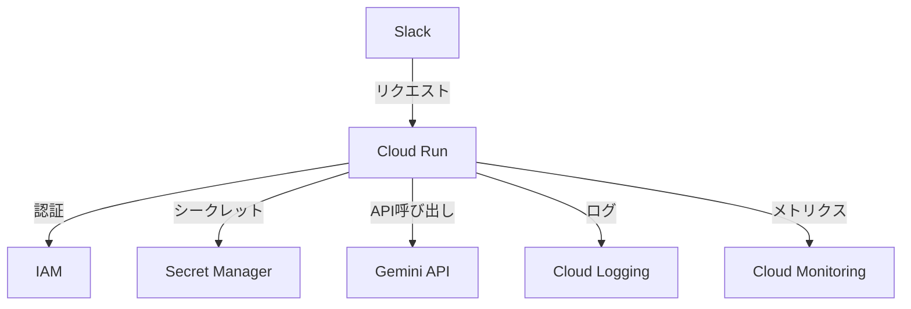

# Cloud Run移行検討ドキュメント

## 1. プラットフォーム比較

### 1.1 Cloud Run
#### 利点
- フルマネージドなコンテナ実行環境
- 自動スケーリング（0から）
- 標準的なコンテナ技術の活用
- Google Cloudの他のサービスとの統合が容易
- 柔軟なリソース設定
- WebSocketsなどの高度な機能のサポート
- 長時間実行ジョブのサポート

#### 制約
- コールドスタート時間（数百ミリ秒〜数秒）
- リージョン単位のデプロイ
- 最小限のインスタンス維持によるコスト

### 1.2 Cloudflare Workers
#### 利点
- エッジでの超低レイテンシー
- グローバルデプロイメント
- 最小限のコールドスタート時間
- 簡単なデプロイメントフロー
- 低コストな運用

#### 制約
- 実行時間制限（CPU時間30秒）
- メモリ制限（128MB）
- 限定的なランタイム環境
- 特殊なAPI設計の必要性

## 2. Cloud Runへの移行メリット

### 2.1 技術的メリット
1. **開発の柔軟性**
   - 標準的なNode.js環境での開発
   - npmパッケージの制限なし
   - TypeScript/Honoの完全なサポート

2. **スケーラビリティ**
   - 需要に応じた自動スケーリング
   - リソースの柔軟な調整
   - 最小/最大インスタンス数の制御

3. **モニタリングと運用**
   - Cloud Monitoringとの統合
   - 詳細なメトリクス収集
   - エラートラッキングの改善

4. **セキュリティ**
   - IAMによる細かなアクセス制御
   - Secret Managerとの統合
   - VPCとの接続オプション

### 2.2 ビジネスメリット
1. **コスト最適化**
   - 使用量ベースの課金
   - リソース使用の効率化
   - 開発効率の向上

2. **保守性**
   - 標準的な開発フローの採用
   - デバッグの容易さ
   - チーム開発の効率化

## 3. 実装アプローチ

### 3.1 アーキテクチャ変更点


### 3.2 主要コンポーネント
1. **Webサーバー**
   ```typescript
   import { Hono } from 'hono';
   import { serve } from '@hono/node-server';

   const app = new Hono();

   // Slackコマンドエンドポイント
   app.post('/slack/command', async (c) => {
     // 実装
   });

   // サーバー起動
   serve({
     fetch: app.fetch,
     port: Number(process.env.PORT) || 8080
   });
   ```

2. **Dockerファイル**
   ```dockerfile
   FROM node:20-slim
   WORKDIR /app
   COPY package*.json ./
   RUN npm ci
   COPY . .
   RUN npm run build
   CMD ["npm", "start"]
   ```

### 3.3 デプロイメントフロー
```bash
# イメージのビルドとプッシュ
docker build -t gcr.io/[PROJECT_ID]/mechachang .
docker push gcr.io/[PROJECT_ID]/mechachang

# Cloud Runへのデプロイ
gcloud run deploy mechachang \
  --image gcr.io/[PROJECT_ID]/mechachang \
  --platform managed \
  --region asia-northeast1 \
  --allow-unauthenticated
```

## 4. コスト分析

### 4.1 Cloud Run予想コスト
- vCPU: 1コア
- メモリ: 512MB
- 月間リクエスト: 100,000件
- 平均レスポンス時間: 2秒

**概算コスト（月額）**
- コンピュート: ¥2,000-3,000
- ネットワーク: ¥500-1,000
- 合計: ¥2,500-4,000

### 4.2 Cloudflare Workers比較
- 無料枠: 100,000リクエスト/日
- 追加リクエスト: $0.15/100万リクエスト
- メモリ使用制限なし

## 5. パフォーマンス考慮点

### 5.1 最適化ポイント
1. **コールドスタート対策**
   - 最小インスタンス数の設定
   - 依存関係の最適化
   - コードの軽量化

2. **メモリ管理**
   - キャッシュ戦略の実装
   - メモリリークの防止
   - リソース使用量の監視

3. **スケーリング設定**
   - 同時実行数の適切な設定
   - オートスケーリングの閾値調整
   - リソース制限の最適化

### 5.2 モニタリング戦略
1. **メトリクス収集**
   - レスポンスタイム
   - エラーレート
   - メモリ使用量
   - CPUリソース使用率

2. **アラート設定**
   - エラー率閾値
   - レイテンシー閾値
   - リソース使用量閾値

## 6. 移行ステップ

### 6.1 準備フェーズ
1. Google Cloudプロジェクトのセットアップ
2. 必要なAPIの有効化
3. サービスアカウントの作成と権限設定
4. シークレットの移行

### 6.2 開発フェーズ
1. ローカル開発環境の構築
2. Dockerコンテナ化
3. CI/CDパイプラインの更新
4. テスト環境の構築

### 6.3 デプロイフェーズ
1. ステージング環境へのデプロイ
2. 動作検証とパフォーマンステスト
3. 本番環境への段階的移行
4. モニタリングの設定

## 7. リスク評価

### 7.1 技術的リスク
1. **パフォーマンス**
   - コールドスタートの影響
   - レイテンシーの変化
   - リソース使用量の増加

2. **互換性**
   - API動作の違い
   - 環境変数の扱い
   - ファイルシステムの制約

### 7.2 運用リスク
1. **コスト**
   - 予期せぬスケーリング
   - リソース過剰割り当て
   - ネットワーク転送量

2. **セキュリティ**
   - 認証情報の管理
   - ネットワークセキュリティ
   - アクセス制御

## 8. 推奨事項

### 8.1 移行推奨理由
1. **開発効率**
   - 標準的な開発環境
   - デバッグの容易さ
   - チーム開発の効率化

2. **運用性**
   - 詳細なモニタリング
   - 柔軟なスケーリング
   - 統合されたログ管理

3. **将来性**
   - 機能拡張の容易さ
   - Google Cloudサービスとの統合
   - コンテナ技術の活用

### 8.2 検討すべき課題
1. **コスト管理**
   - 適切なリソース設定
   - スケーリング戦略
   - 最小インスタンス数

2. **パフォーマンス**
   - コールドスタート対策
   - リソース最適化
   - キャッシュ戦略

3. **運用体制**
   - モニタリング体制
   - インシデント対応
   - バックアップ戦略