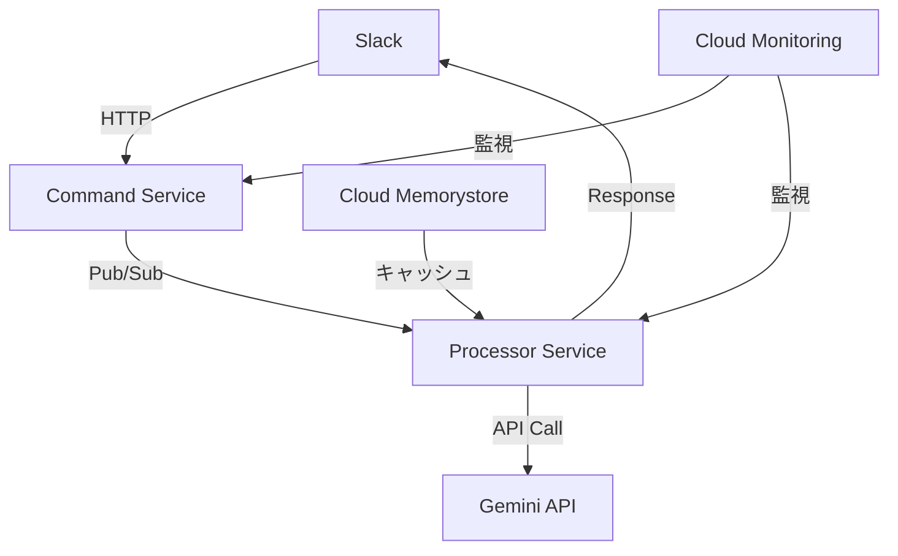

# Mechachang 新アーキテクチャ計画

## 1. プロジェクト概要

### 1.1 目的
- TypeScriptとHonoを使用した新基盤への移行
- Cloud Runベースのアーキテクチャ採用
- 運用性とスケーラビリティの向上
- コスト効率の最適化

### 1.2 主要機能
- Slackスラッシュコマンド（`/gemini`）
- Gemini 2.0 Flash APIとの連携
- 構造化された応答フォーマット
- 4つの応答モード（general, code, data, creative）

## 2. アーキテクチャ設計

### 2.1 システム構成


### 2.2 コンポーネント構成
1. **Command Service**
   - Slackコマンドの受付
   - リクエストの検証
   - 即時応答の送信
   - タスクのキューイング

2. **Processor Service**
   - Gemini APIとの通信
   - 応答の生成と整形
   - エラーハンドリング
   - 結果の送信

3. **共通基盤**
   - モニタリング
   - ログ管理
   - キャッシュ
   - エラー処理

## 3. 技術スタック

### 3.1 基本構成
```json
{
  "dependencies": {
    "typescript": "^5.3.3",
    "hono": "^4.0.0",
    "@google/generative-ai": "^0.22.0",
    "@google-cloud/pubsub": "^4.0.0",
    "@google-cloud/monitoring": "^4.0.0"
  }
}
```

### 3.2 インフラストラクチャ
- Cloud Run (Gen2)
- Cloud Pub/Sub
- Cloud Monitoring
- Cloud Memorystore

### 3.3 開発ツール
- Vitest: テストフレームワーク
- Wrangler: デプロイツール
- Prettier: コードフォーマッター

## 4. 実装詳細

### 4.1 Command Service
```typescript
// app.ts
import { Hono } from 'hono';
import { PubSub } from '@google-cloud/pubsub';

const app = new Hono();
const pubsub = new PubSub();

app.post('/slack/command', async (c) => {
  const body = await c.req.parseBody();

  // 即時応答
  c.json({
    response_type: 'in_channel',
    text: '処理を開始しました...'
  });

  // 非同期処理のキューイング
  await pubsub.topic('gemini-requests').publish(
    Buffer.from(JSON.stringify(body))
  );
});
```

### 4.2 Processor Service
```typescript
// processor.ts
import { GenerativeModel } from '@google/generative-ai';

export class GeminiProcessor {
  private model: GenerativeModel;

  constructor(apiKey: string) {
    this.model = new GenerativeModel({
      model: 'gemini-pro',
      apiKey
    });
  }

  async process(text: string): Promise<string> {
    const result = await this.model.generateContent(text);
    return this.formatResponse(result);
  }
}
```

### 4.3 設定
```yaml
# command-service.yaml
spec:
  template:
    metadata:
      annotations:
        autoscaling.knative.dev/minScale: "1"
        autoscaling.knative.dev/maxScale: "10"
    spec:
      timeoutSeconds: 60
      containers:
      - name: command-service
        resources:
          limits:
            cpu: "1"
            memory: "512Mi"

# processor-service.yaml
spec:
  template:
    metadata:
      annotations:
        autoscaling.knative.dev/minScale: "0"
        autoscaling.knative.dev/maxScale: "20"
    spec:
      timeoutSeconds: 300
      containers:
      - name: processor-service
        resources:
          limits:
            cpu: "2"
            memory: "2Gi"
```

## 5. コスト分析

### 5.1 予想コスト（月間）
```
Command Service:     ¥9,800
Processor Service:   ¥23,900
Pub/Sub:            ¥6
Monitoring:         ¥1,900
Memorystore:        ¥5,300
---------------------------------
合計:               約¥41,000/月
```

### 5.2 コスト最適化戦略
1. **リソース使用の効率化**
   - 適切なスケーリング設定
   - キャッシュ戦略の活用
   - 処理の最適化

2. **モニタリングコストの最適化**
   - 重要メトリクスの選択
   - ログレベルの調整
   - 保持期間の最適化

## 6. 移行計画

### Phase 1: 基盤構築（2週間）
1. **Week 1: 開発環境整備**
   - リポジトリ作成
   - CI/CD設定
   - 開発環境構築

2. **Week 2: 基本実装**
   - Command Serviceの実装
   - Processor Serviceの実装
   - 基本的なテストの作成

### Phase 2: 機能実装（3週間）
1. **Week 3: コア機能**
   - Pub/Sub連携
   - Gemini API統合
   - エラーハンドリング

2. **Week 4-5: 最適化**
   - パフォーマンスチューニング
   - モニタリング設定
   - テスト強化

### Phase 3: 移行実施（1週間）
1. **準備（2日）**
   - 最終テスト
   - バックアップ
   - ロールバック手順確認

2. **展開（3日）**
   - 段階的なデプロイ
   - モニタリング確認
   - 問題対応

3. **完了（2日）**
   - 全面移行
   - 動作確認
   - ドキュメント更新

## 7. 運用戦略

### 7.1 モニタリング
```yaml
# monitoring.yaml
metrics:
  - name: request_latency
    type: DISTRIBUTION
    labels:
      - service
      - endpoint

  - name: error_rate
    type: GAUGE
    labels:
      - service
      - type

alerts:
  - name: high_latency
    condition: latency.p95 > 2000ms
    severity: warning

  - name: high_error_rate
    condition: error_rate > 0.01
    severity: critical
```

### 7.2 バックアップ戦略
1. **設定のバックアップ**
   - Infrastructure as Code
   - 環境変数の管理
   - デプロイ設定

2. **障害復旧計画**
   - ロールバック手順
   - データ復旧手順
   - 連絡フロー

### 7.3 保守計画
- 定期的なセキュリティ更新
- 依存関係の更新
- パフォーマンス最適化
- コスト分析

## 8. 成功基準

### 8.1 技術指標
- レスポンスタイム: p95 < 2秒
- エラーレート: < 0.1%
- 可用性: > 99.9%
- CPU使用率: < 70%

### 8.2 ビジネス指標
- 運用コストの削減
- 開発効率の向上
- ユーザー満足度の向上
- システム安定性の向上

## 9. 今後の展開

### 9.1 短期的な改善
- パフォーマンス最適化
- モニタリングの強化
- エラーハンドリングの改善

### 9.2 中長期的な計画
- 新機能の追加
- スケーリング戦略の最適化
- セキュリティ強化
- 運用自動化の推進