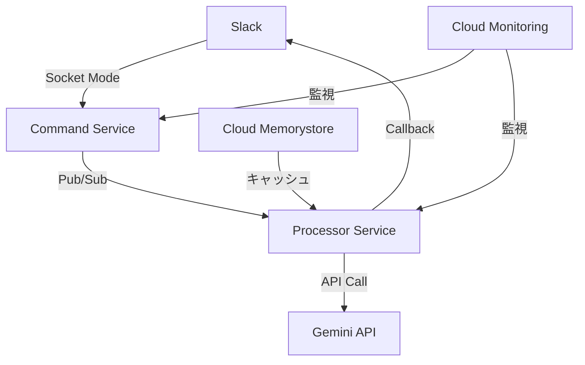

# Mechachang 新基盤移行計画

## 1. 概要

### 1.1 目的
- TypeScriptとHonoを使用した新基盤への移行
- Cloud Runベースのアーキテクチャ採用
- タイムアウト制約への対応強化
- 運用性とスケーラビリティの向上

### 1.2 移行のポイント
- Socket Modeを活用したSlack通信
- マイクロサービス化による責務の分離
- 非同期処理によるタイムアウト対策
- 包括的なモニタリング体制の構築

## 2. 新アーキテクチャ

### 2.1 システム構成


### 2.2 コンポーネント
1. **Command Service**
   - Slack通信の処理
   - リクエストの検証
   - タスクのキューイング

2. **Processor Service**
   - Gemini APIとの通信
   - 結果の整形
   - エラーハンドリング

3. **共通基盤**
   - モニタリング
   - ログ管理
   - キャッシュ

## 3. 技術スタック

### 3.1 基本構成
- TypeScript 5.3+
- Hono 4.0+
- Cloud Run (Gen2)
- Cloud Pub/Sub
- Cloud Monitoring
- Cloud Memorystore

### 3.2 主要ライブラリ
```json
{
  "dependencies": {
    "hono": "^4.0.0",
    "@google/generative-ai": "^0.22.0",
    "@slack/bolt": "^3.17.0",
    "@google-cloud/pubsub": "^4.0.0",
    "@google-cloud/monitoring": "^4.0.0"
  }
}
```

## 4. 移行フェーズ

### Phase 1: 基盤構築（2週間）

1. **Week 1: 開発環境整備**
   - リポジトリ作成
   - CI/CD設定
   - 開発環境構築
   - テスト環境構築

2. **Week 2: 基本実装**
   - Command Serviceの実装
   - Processor Serviceの実装
   - 基本的なテストの作成

### Phase 2: 機能実装（3週間）

1. **Week 3: コア機能**
   - Socket Mode実装
   - Pub/Sub連携
   - Gemini API統合

2. **Week 4: エラーハンドリング**
   - タイムアウト処理
   - リトライ機構
   - エラー通知

3. **Week 5: モニタリング**
   - メトリクス設定
   - アラート設定
   - ログ管理

### Phase 3: テストと最適化（2週間）

1. **Week 6: テスト強化**
   - 単体テスト
   - 統合テスト
   - 負荷テスト

2. **Week 7: パフォーマンス最適化**
   - キャッシュ実装
   - スケーリング調整
   - パフォーマンステスト

### Phase 4: 移行実施（1週間）

1. **Day 1-2: 準備**
   - 最終テスト
   - バックアップ
   - ロールバック手順確認

2. **Day 3-5: 段階的移行**
   - 一部ユーザーでの試験運用
   - モニタリング確認
   - 問題対応

3. **Day 6-7: 完全移行**
   - 全ユーザーへの展開
   - 旧システムの停止
   - 動作確認

## 5. 設定詳細

### 5.1 Command Service設定
```yaml
# command-service.yaml
spec:
  template:
    metadata:
      annotations:
        autoscaling.knative.dev/minScale: "1"
        autoscaling.knative.dev/maxScale: "10"
    spec:
      timeoutSeconds: 60
      containers:
      - name: command-service
        resources:
          limits:
            cpu: "1"
            memory: "512Mi"
        env:
        - name: SLACK_SOCKET_MODE
          value: "true"
        - name: MAX_CONCURRENT_REQUESTS
          value: "80"
```

### 5.2 Processor Service設定
```yaml
# processor-service.yaml
spec:
  template:
    metadata:
      annotations:
        autoscaling.knative.dev/minScale: "0"
        autoscaling.knative.dev/maxScale: "20"
    spec:
      timeoutSeconds: 300
      containers:
      - name: processor-service
        resources:
          limits:
            cpu: "2"
            memory: "2Gi"
        env:
        - name: GEMINI_TIMEOUT
          value: "55000"
        - name: RETRY_COUNT
          value: "3"
```

## 6. モニタリング計画

### 6.1 メトリクス
- レイテンシー（p50, p95, p99）
- エラーレート
- リクエスト数
- CPU/メモリ使用率
- Pub/Subキュー長

### 6.2 アラート
```yaml
# alerts.yaml
alerts:
  - name: high-error-rate
    condition: error_rate > 0.01
    duration: 5m
    notification: critical

  - name: high-latency
    condition: p95_latency > 2500
    duration: 10m
    notification: warning
```

## 7. リスク管理

### 7.1 主要リスク
1. **タイムアウト関連**
   - 対策: Socket Mode + 非同期処理
   - モニタリング強化
   - 自動リトライ

2. **データ整合性**
   - 対策: トランザクション管理
   - 冪等性の確保
   - バックアップ体制

3. **パフォーマンス**
   - 対策: キャッシュ戦略
   - スケーリング最適化
   - 負荷分散

### 7.2 ロールバック計画
1. **判断基準**
   - エラーレート > 1%
   - レイテンシーp95 > 5秒
   - 重大なバグ発見

2. **手順**
   - トラフィック切り戻し
   - 旧システム再起動
   - ユーザー通知

## 8. 運用準備

### 8.1 ドキュメント
- アーキテクチャ図
- API仕様書
- 運用マニュアル
- トラブルシューティングガイド

### 8.2 運用体制
- オンコール体制
- エスカレーションフロー
- インシデント対応手順
- 定期メンテナンス計画

## 9. 成功基準

### 9.1 技術指標
- エラーレート < 0.1%
- レイテンシーp95 < 2.5秒
- CPU使用率 < 70%
- メモリ使用率 < 80%

### 9.2 ビジネス指標
- システム安定性向上
- 運用コスト削減
- ユーザー満足度向上
- 開発効率の改善

## 10. 今後の展開

### 10.1 短期的な改善
- パフォーマンスチューニング
- モニタリングの強化
- エラーハンドリングの改善

### 10.2 中長期的な計画
- 新機能の追加
- スケーリング戦略の最適化
- セキュリティ強化