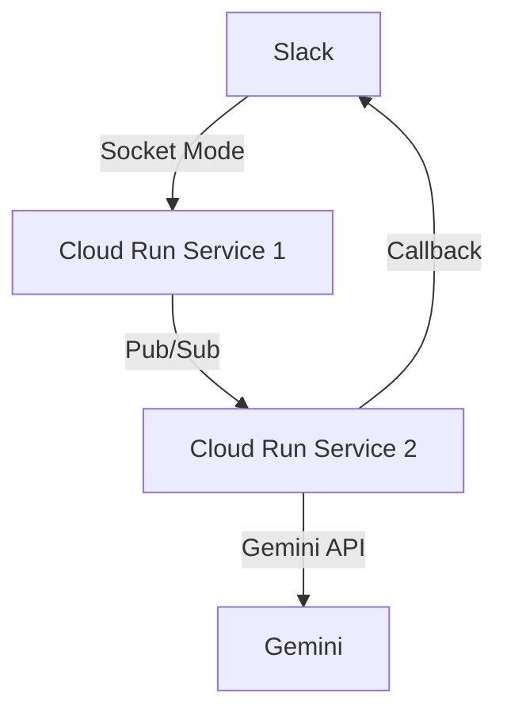

# 制約に関する最新情報（2024年2月時点）

## 1. Slack API最新情報

### 1.1 スラッシュコマンドの制約
- 即時応答: 3秒以内（変更なし）
- 応答URL: 30分間有効（変更なし）
- 新機能: ソケットモード対応強化
  - WebSocketを使用した双方向通信
  - タイムアウトの影響を受けにくい

### 1.2 メッセージAPI
- Rate Limits: 更新あり
  - Tier 1: 1分あたり1アプリで最大100リクエスト
  - Tier 2: 1分あたり1アプリで最大200リクエスト
  - Tier 3: エンタープライズグリッド用の高レート制限
- 新機能: メッセージメタデータのサポート
  - event_ts: メッセージイベントのタイムスタンプ
  - thread_ts: スレッドの識別子

## 2. Cloud Run最新情報

### 2.1 新機能
- **HTTP/2サポートの強化**
  - 双方向ストリーミングのサポート
  - レイテンシーの改善

- **カスタムヘルスチェック**
  ```yaml
  spec:
    template:
      spec:
        containers:
        - name: app
          livenessProbe:
            httpGet:
              path: /health
              port: 8080
            initialDelaySeconds: 10
            periodSeconds: 5
  ```

- **セキュリティ強化**
  - コンテナ署名の必須化オプション
  - Binary Authorization統合

### 2.2 制約の更新
- 実行時間制限
  - 最大: 60分（変更なし）
  - 推奨: 30分以内
- メモリ制限
  - 最大: 32GB（変更なし）
  - 新しい価格帯の追加
- 同時リクエスト
  - デフォルト: 80（変更なし）
  - カスタム設定: 1-1000

### 2.3 新しいデプロイオプション
```bash
gcloud run deploy SERVICE_NAME \
  --image IMAGE_URL \
  --cpu=2 \
  --memory=2Gi \
  --timeout=3600 \
  --concurrency=80 \
  --min-instances=1 \
  --max-instances=10 \
  --execution-environment=gen2
```

## 3. Gemini API最新情報

### 3.1 制約
- リクエストタイムアウト: 60秒
- トークン生成制限: 2048トークン/秒
- 同時リクエスト: 無制限
- コンテキストウィンドウ: 32K トークン

### 3.2 新機能
- ストリーミングレスポンス
- マルチモーダル入力
- 構造化出力のサポート強化

## 4. Hono v4.0の新機能

### 4.1 タイムアウト関連
```typescript
import { Hono } from 'hono'
import { timing } from 'hono/timing'

const app = new Hono()

// タイミングミドルウェアの追加
app.use('*', timing())

// タイムアウト設定
app.use('*', async (c, next) => {
  const timeoutPromise = new Promise((_, reject) => {
    setTimeout(() => reject(new Error('Timeout')), 3000)
  })

  try {
    await Promise.race([next(), timeoutPromise])
  } catch (e) {
    if (e.message === 'Timeout') {
      return c.json({ error: 'Request timeout' }, 504)
    }
    throw e
  }
})
```

### 4.2 エラーハンドリングの改善
```typescript
import { Hono } from 'hono'
import { HTTPException } from 'hono/http-exception'

const app = new Hono()

// カスタムエラーハンドラー
app.onError((err, c) => {
  if (err instanceof HTTPException) {
    return c.json({
      error: err.message,
      code: err.status,
    }, err.status)
  }

  console.error(`[${c.req.method}] ${c.req.url}`, err)
  return c.json({ error: 'Internal Server Error' }, 500)
})
```

## 5. 更新された推奨アーキテクチャ

### 5.1 システム構成


### 5.2 タイムアウト設定の最適化
```yaml
# service1.yaml (コマンド受付)
spec:
  template:
    spec:
      timeoutSeconds: 60
      containers:
      - name: command-service
        resources:
          limits:
            cpu: "1"
            memory: "512Mi"
        env:
        - name: MAX_CONCURRENT_REQUESTS
          value: "80"
        - name: SLACK_SOCKET_MODE
          value: "true"

# service2.yaml (処理サービス)
spec:
  template:
    spec:
      timeoutSeconds: 300
      containers:
      - name: processor-service
        resources:
          limits:
            cpu: "2"
            memory: "2Gi"
        env:
        - name: GEMINI_TIMEOUT
          value: "55000"
        - name: MAX_RETRIES
          value: "3"
```

## 6. 改善された実装例

### 6.1 Socket Modeを使用したSlack通信
```typescript
import { App } from '@slack/bolt';

const app = new App({
  token: process.env.SLACK_BOT_TOKEN,
  socketMode: true,
  appToken: process.env.SLACK_APP_TOKEN
});

app.command('/gemini', async ({ command, ack, respond }) => {
  await ack();

  // Pub/Subにメッセージを送信
  await publishMessage('gemini-requests', {
    text: command.text,
    response_url: command.response_url,
    user_id: command.user_id
  });

  await respond({
    text: '処理を開始しました...',
    response_type: 'in_channel'
  });
});
```

### 6.2 改善されたエラーハンドリング
```typescript
class GeminiTimeoutError extends Error {
  constructor(message: string) {
    super(message);
    this.name = 'GeminiTimeoutError';
  }
}

async function processWithTimeout<T>(
  promise: Promise<T>,
  timeoutMs: number,
  errorMessage: string
): Promise<T> {
  const timeout = new Promise<never>((_, reject) => {
    setTimeout(() => reject(new GeminiTimeoutError(errorMessage)), timeoutMs);
  });

  return Promise.race([promise, timeout]);
}

// 使用例
try {
  const result = await processWithTimeout(
    geminiClient.generateContent(prompt),
    55000,
    'Gemini API request timed out'
  );

  await notifySlack(result);
} catch (error) {
  if (error instanceof GeminiTimeoutError) {
    await notifySlack({
      text: 'AIの応答に時間がかかりすぎています。後でもう一度お試しください。',
      response_type: 'ephemeral'
    });

    // メトリクスの記録
    metrics.timeoutErrors.inc({
      api: 'gemini',
      type: 'timeout'
    });
  }
}
```

## 7. 新しいモニタリング戦略

### 7.1 Cloud Monitoringダッシュボード
```yaml
dashboards:
  - name: "Mechachang Performance"
    widgets:
      - title: "API Latency"
        xyChart:
          dataSets:
            - timeSeriesQuery:
                projectName: projects/YOUR_PROJECT
                filter: metric.type="custom.googleapis.com/api/latency"
      - title: "Timeout Errors"
        xyChart:
          dataSets:
            - timeSeriesQuery:
                projectName: projects/YOUR_PROJECT
                filter: metric.type="custom.googleapis.com/errors/timeout"
```

### 7.2 アラート閾値の更新
```yaml
alerts:
  - name: high-latency
    condition: rate(api_latency{quantile="0.95"}[5m]) > 2500
    notification:
      slack:
        channel: "#alerts"
        message: "API応答時間が遅くなっています"

  - name: timeout-spike
    condition: rate(timeout_errors[1m]) > 0.05
    notification:
      slack:
        channel: "#alerts"
        message: "タイムアウトエラーが増加しています"
```

## 8. 今後の検討事項

1. **Socket Mode移行**
   - WebSocketベースの通信への完全移行
   - イベント駆動型アーキテクチャの採用

2. **キャッシュ戦略**
   - 類似リクエストの結果キャッシュ
   - Cloud Memorystore（Redis）の活用

3. **スケーリング最適化**
   - 需要予測に基づく事前スケーリング
   - コスト効率の改善

4. **エラー復旧戦略**
   - 自動リトライの洗練化
   - バックオフ戦略の最適化