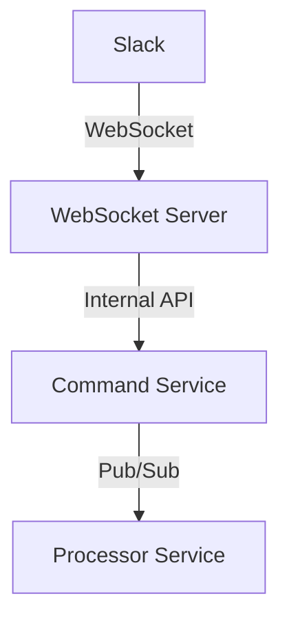
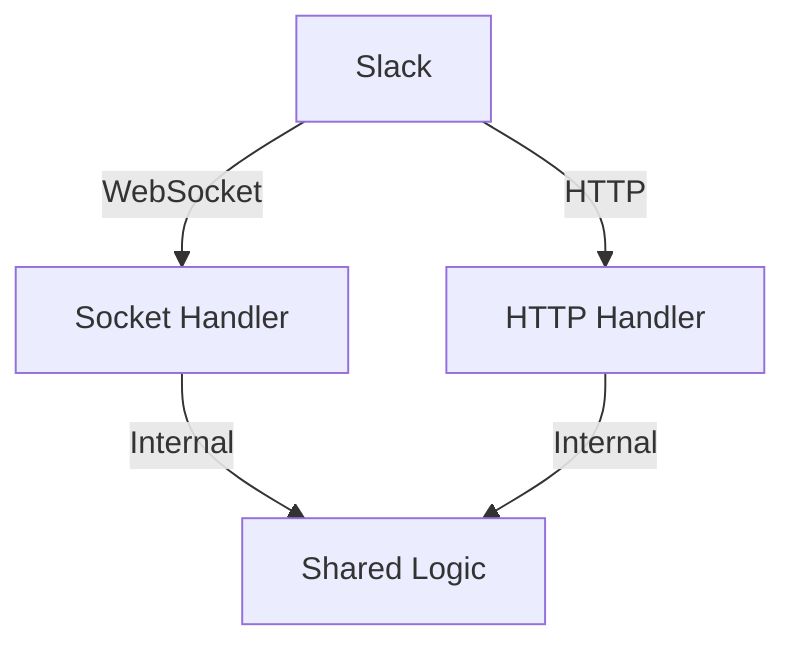
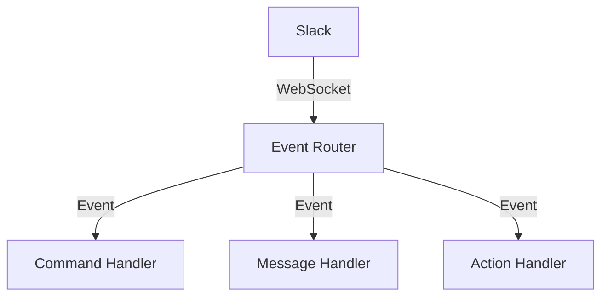
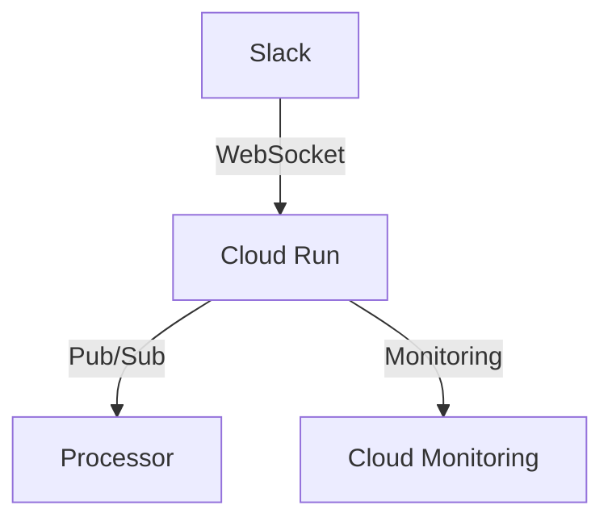
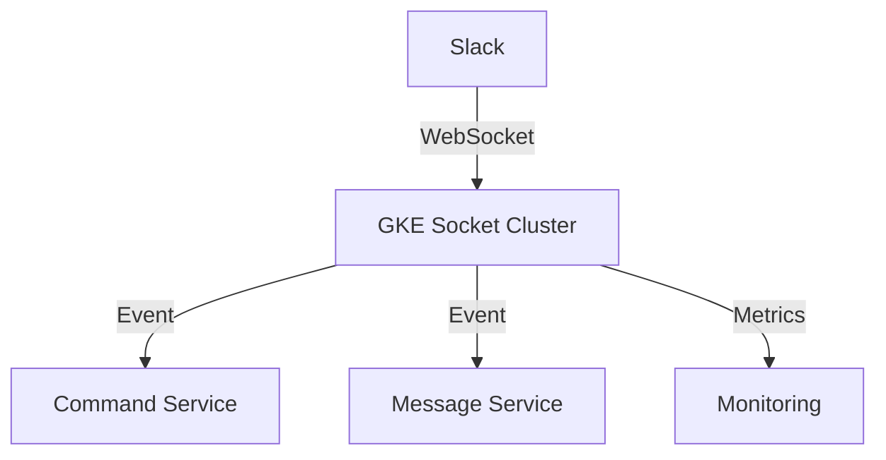

# Socket Mode実装アーキテクチャ比較

## 1. アプローチパターン

### 1.1 専用WebSocketサーバー方式


#### メリット
- WebSocket接続の完全な制御
- 接続状態の詳細な管理
- カスタマイズ性が高い

#### デメリット
- インフラ管理の複雑さ
- 運用コストが高い
- 開発工数が大きい

#### 実装例
```typescript
// websocket-server.ts
import { WebSocketServer } from 'ws';
import { App } from '@slack/bolt';

const wss = new WebSocketServer({ port: 8080 });
const app = new App({
  token: process.env.SLACK_BOT_TOKEN,
  appToken: process.env.SLACK_APP_TOKEN,
  socketMode: true
});

wss.on('connection', (ws) => {
  ws.on('message', async (data) => {
    // メッセージ処理
    const response = await processMessage(data);
    ws.send(JSON.stringify(response));
  });
});
```

### 1.2 ハイブリッドアプローチ


#### メリット
- 既存のHTTPエンドポイントとの共存
- 段階的な移行が可能
- リソースの効率的な利用

#### デメリット
- 実装の複雑さ
- 状態管理の難しさ
- テストの複雑化

#### 実装例
```typescript
// hybrid-server.ts
import { Hono } from 'hono';
import { App } from '@slack/bolt';

const app = new Hono();
const slackApp = new App({
  token: process.env.SLACK_BOT_TOKEN,
  appToken: process.env.SLACK_APP_TOKEN,
  socketMode: true
});

// HTTP Handler
app.post('/slack/events', async (c) => {
  // HTTPリクエスト処理
});

// Socket Handler
slackApp.message(async ({ message, say }) => {
  // WebSocketメッセージ処理
});
```

### 1.3 イベント駆動型アーキテクチャ


#### メリット
- 高い拡張性
- 疎結合な設計
- テストが容易

#### デメリット
- 初期設計の複雑さ
- イベント管理のオーバーヘッド
- デバッグの難しさ

#### 実装例
```typescript
// event-driven-server.ts
import { EventEmitter } from 'events';
import { App } from '@slack/bolt';

const eventBus = new EventEmitter();
const app = new App({
  token: process.env.SLACK_BOT_TOKEN,
  appToken: process.env.SLACK_APP_TOKEN,
  socketMode: true
});

// イベントハンドラー
eventBus.on('command', async (data) => {
  // コマンド処理
});

eventBus.on('message', async (data) => {
  // メッセージ処理
});

// Slackイベントルーティング
app.message(async ({ message }) => {
  eventBus.emit('message', message);
});
```

## 2. インフラストラクチャ比較

### 2.1 Cloud Run
```yaml
# cloud-run-socket.yaml
spec:
  template:
    spec:
      containers:
      - name: socket-server
        ports:
        - containerPort: 8080
        env:
        - name: SOCKET_MODE
          value: "true"
```

#### メリット
- オートスケーリング
- 管理の容易さ
- コスト効率

#### デメリット
- WebSocket接続の制限
- コールドスタートの影響
- 長時間接続の課題

### 2.2 Compute Engine
```yaml
# compute-engine-socket.yaml
resources:
  - name: socket-server
    type: compute.v1.instance
    properties:
      machineType: e2-medium
      networkInterfaces:
      - network: default
        accessConfigs:
        - name: External NAT
          type: ONE_TO_ONE_NAT
```

#### メリット
- 完全な制御
- 安定した接続
- カスタマイズ性

#### デメリット
- 高コスト
- 運用負荷
- スケーリングの複雑さ

### 2.3 GKE
```yaml
# kubernetes-socket.yaml
apiVersion: apps/v1
kind: Deployment
metadata:
  name: socket-server
spec:
  replicas: 3
  template:
    spec:
      containers:
      - name: socket-server
        ports:
        - containerPort: 8080
```

#### メリット
- 高可用性
- 柔軟なスケーリング
- 詳細な制御

#### デメリット
- 複雑な運用
- 高コスト
- 学習コスト

## 3. 推奨アーキテクチャ

### 3.1 開発初期フェーズ


#### 実装戦略
1. イベント駆動型アーキテクチャの採用
2. Cloud Runでの実装
3. Pub/Subによる非同期処理

#### 設定例
```typescript
// app.ts
import { App } from '@slack/bolt';
import { PubSub } from '@google-cloud/pubsub';

const app = new App({
  token: process.env.SLACK_BOT_TOKEN,
  appToken: process.env.SLACK_APP_TOKEN,
  socketMode: true
});

const pubsub = new PubSub();

app.message(async ({ message, say }) => {
  // 即時応答
  await say('処理を開始します...');

  // 非同期処理
  await pubsub.topic('message-processing').publish(
    Buffer.from(JSON.stringify(message))
  );
});
```

### 3.2 スケールフェーズ


#### スケーリング戦略
1. GKEへの段階的移行
2. マイクロサービス化
3. 負荷分散の最適化

## 4. 評価基準

### 4.1 技術評価
| 基準 | Cloud Run | Compute Engine | GKE |
|------|-----------|----------------|-----|
| スケーラビリティ | ⭐⭐⭐⭐ | ⭐⭐ | ⭐⭐⭐⭐⭐ |
| 運用性 | ⭐⭐⭐⭐⭐ | ⭐⭐ | ⭐⭐⭐ |
| 開発効率 | ⭐⭐⭐⭐ | ⭐⭐⭐ | ⭐⭐⭐ |
| コスト | ⭐⭐⭐⭐ | ⭐⭐ | ⭐⭐ |

### 4.2 コスト評価
| サービス | 初期コスト | 運用コスト | スケールコスト |
|----------|------------|------------|----------------|
| Cloud Run | 低 | 中 | 中 |
| Compute Engine | 低 | 高 | 高 |
| GKE | 中 | 高 | 中 |

## 5. 結論と推奨事項

### 5.1 推奨アプローチ
1. **フェーズ1: Cloud Run + イベント駆動型**
   - 開発の容易さ
   - 運用コストの最適化
   - スケーラビリティの確保

2. **フェーズ2: 必要に応じてGKEへの移行**
   - トラフィック増加時
   - より細かい制御が必要な場合
   - 高可用性要件の増加時

### 5.2 実装ロードマップ
1. Cloud Runでのプロトタイプ開発
2. イベント駆動アーキテクチャの実装
3. モニタリングと最適化
4. 必要に応じたインフラ移行