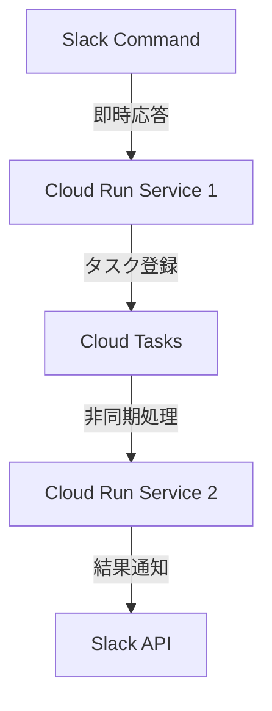

# タイムアウト制約の調査と対策

## 1. Slack APIの制約

### 1.1 スラッシュコマンドの制約
- 即時応答要件: 3秒以内
- タイムアウト: 最大3秒で応答がない場合、エラーとして扱われる
- 応答URL: 30分間有効

### 1.2 メッセージAPIの制約
- Rate Limits: ワークスペース単位で制限
  - Tier 1: 1分あたり1チームで最大50リクエスト
  - Tier 2: 1分あたり1アプリで最大100リクエスト
- メッセージ更新: 最大5分以内
- ペイロードサイズ: 最大100KB

## 2. Cloud Runの制約

### 2.1 実行時間制限
- デフォルト: 5分（300秒）
- 最大: 60分（3600秒）
- 推奨: 長時間実行が必要な場合は非同期処理を検討

### 2.2 その他の制約
- メモリ: 最大32GB
- CPU: 最大8vCPU
- 同時リクエスト: デフォルトで80
- コンテナ起動時間: 最大2分

## 3. 現在の実装への影響

### 3.1 Slackコマンド処理
```typescript
// 現在の実装
app.post('/slack/command', async (c) => {
  // 3秒以内に応答する必要がある
  const immediateResponse = {
    response_type: 'in_channel',
    text: '処理を開始しました...'
  };

  // バックグラウンド処理
  c.executionCtx.waitUntil(
    processGeminiRequest(/* params */)
  );

  return c.json(immediateResponse);
});
```

### 3.2 Gemini API処理
```typescript
// 現在の実装
async function processGeminiRequest(params) {
  // 処理時間が不定
  const response = await model.generateContent(/* params */);

  // Slackへの応答
  await fetch(responseUrl, {
    method: 'POST',
    body: JSON.stringify(response)
  });
}
```

## 4. Cloud Runでの対策案

### 4.1 アーキテクチャの改善


### 4.2 実装案

1. **コマンド受付サービス**
```typescript
import { Hono } from 'hono';
import { CloudTasksClient } from '@google-cloud/tasks';

const app = new Hono();
const tasksClient = new CloudTasksClient();

app.post('/slack/command', async (c) => {
  // 即時応答（3秒以内）
  const immediateResponse = {
    response_type: 'in_channel',
    text: '処理を開始しました...'
  };

  // タスクの作成
  const task = {
    httpRequest: {
      httpMethod: 'POST',
      url: 'https://processor-service-url/process',
      body: Buffer.from(JSON.stringify({
        text: c.req.body.text,
        response_url: c.req.body.response_url
      })).toString('base64'),
      headers: {
        'Content-Type': 'application/json'
      }
    },
    scheduleTime: {
      seconds: Date.now() / 1000 + 1 // 1秒後に実行
    }
  };

  await tasksClient.createTask({
    parent: tasksClient.queuePath(
      process.env.PROJECT_ID,
      process.env.LOCATION,
      'gemini-tasks'
    ),
    task
  });

  return c.json(immediateResponse);
});
```

2. **処理サービス**
```typescript
import { Hono } from 'hono';

const app = new Hono();

app.post('/process', async (c) => {
  const { text, response_url } = await c.req.json();

  try {
    // Gemini APIでの処理
    const result = await processGeminiRequest(text);

    // Slackへの応答
    await fetch(response_url, {
      method: 'POST',
      headers: { 'Content-Type': 'application/json' },
      body: JSON.stringify({
        response_type: 'in_channel',
        text: result
      })
    });

    return c.json({ status: 'success' });
  } catch (error) {
    // エラー通知
    await fetch(response_url, {
      method: 'POST',
      headers: { 'Content-Type': 'application/json' },
      body: JSON.stringify({
        response_type: 'ephemeral',
        text: 'エラーが発生しました'
      })
    });

    throw error;
  }
});
```

### 4.3 タイムアウト設定

1. **コマンド受付サービス**
```yaml
# service1.yaml
spec:
  template:
    metadata:
      annotations:
        autoscaling.knative.dev/maxScale: "10"
    spec:
      timeoutSeconds: 60  # 1分
      containers:
      - image: gcr.io/project/mechachang-command
        resources:
          limits:
            cpu: "1"
            memory: "512Mi"
```

2. **処理サービス**
```yaml
# service2.yaml
spec:
  template:
    metadata:
      annotations:
        autoscaling.knative.dev/maxScale: "5"
    spec:
      timeoutSeconds: 300  # 5分
      containers:
      - image: gcr.io/project/mechachang-processor
        resources:
          limits:
            cpu: "2"
            memory: "1Gi"
```

## 5. エラーハンドリング戦略

### 5.1 タイムアウトエラーの検出
```typescript
async function handleRequest(req) {
  try {
    const timeoutPromise = new Promise((_, reject) =>
      setTimeout(() => reject(new Error('Timeout')), 270000) // 4.5分
    );

    const resultPromise = processRequest(req);
    const result = await Promise.race([timeoutPromise, resultPromise]);

    return result;
  } catch (error) {
    if (error.message === 'Timeout') {
      // タイムアウト時の処理
      await notifyTimeout();
    }
    throw error;
  }
}
```

### 5.2 リトライ戦略
```typescript
const retryConfig = {
  maxRetries: 3,
  initialDelayMs: 1000,
  maxDelayMs: 10000,
  backoffMultiplier: 2
};

async function withRetry(fn) {
  let attempt = 0;
  let delay = retryConfig.initialDelayMs;

  while (attempt < retryConfig.maxRetries) {
    try {
      return await fn();
    } catch (error) {
      attempt++;
      if (attempt === retryConfig.maxRetries) throw error;

      await new Promise(resolve =>
        setTimeout(resolve, Math.min(delay, retryConfig.maxDelayMs))
      );
      delay *= retryConfig.backoffMultiplier;
    }
  }
}
```

## 6. モニタリングと通知

### 6.1 メトリクス収集
```typescript
const metrics = {
  processingTime: new client.Distribution('processing_time'),
  timeoutErrors: new client.Counter('timeout_errors'),
  retryAttempts: new client.Counter('retry_attempts')
};

async function trackProcessing(fn) {
  const startTime = Date.now();
  try {
    const result = await fn();
    metrics.processingTime.record(Date.now() - startTime);
    return result;
  } catch (error) {
    if (error.message === 'Timeout') {
      metrics.timeoutErrors.inc();
    }
    throw error;
  }
}
```

### 6.2 アラート設定
```yaml
# alerts.yaml
alerts:
  - name: high-timeout-rate
    condition: rate(timeout_errors[5m]) > 0.1
    notification:
      slack:
        channel: "#alerts"
        message: "タイムアウトエラーの発生率が高くなっています"

  - name: long-processing-time
    condition: rate(processing_time{quantile="0.95"}[5m]) > 240
    notification:
      slack:
        channel: "#alerts"
        message: "処理時間が長くなっています"
```

## 7. 推奨設定

### 7.1 Cloud Run設定
- コマンド受付サービス
  - タイムアウト: 60秒
  - メモリ: 512MB
  - CPU: 1vCPU
  - 最小インスタンス: 1

- 処理サービス
  - タイムアウト: 300秒
  - メモリ: 1GB
  - CPU: 2vCPU
  - 最小インスタンス: 0

### 7.2 Cloud Tasks設定
- キュー設定
  - 最大同時実行数: 5
  - レート制限: 10/秒
  - リトライ設定: 最大3回
  - バックオフ: 初期10秒、最大300秒

### 7.3 スケーリング設定
```yaml
# autoscaling.yaml
spec:
  template:
    metadata:
      annotations:
        autoscaling.knative.dev/minScale: "1"
        autoscaling.knative.dev/maxScale: "10"
        autoscaling.knative.dev/target: "80"
```

## 8. 移行手順

1. **準備フェーズ**
   - Cloud Tasksキューの作成
   - サービスアカウントの設定
   - 環境変数の構成

2. **実装フェーズ**
   - コマンド受付サービスの実装
   - 処理サービスの実装
   - エラーハンドリングの実装

3. **テストフェーズ**
   - タイムアウトテストの実施
   - 負荷テストの実行
   - エラー処理の検証

4. **デプロイフェーズ**
   - 段階的なデプロイ
   - モニタリングの設定
   - アラートの構成